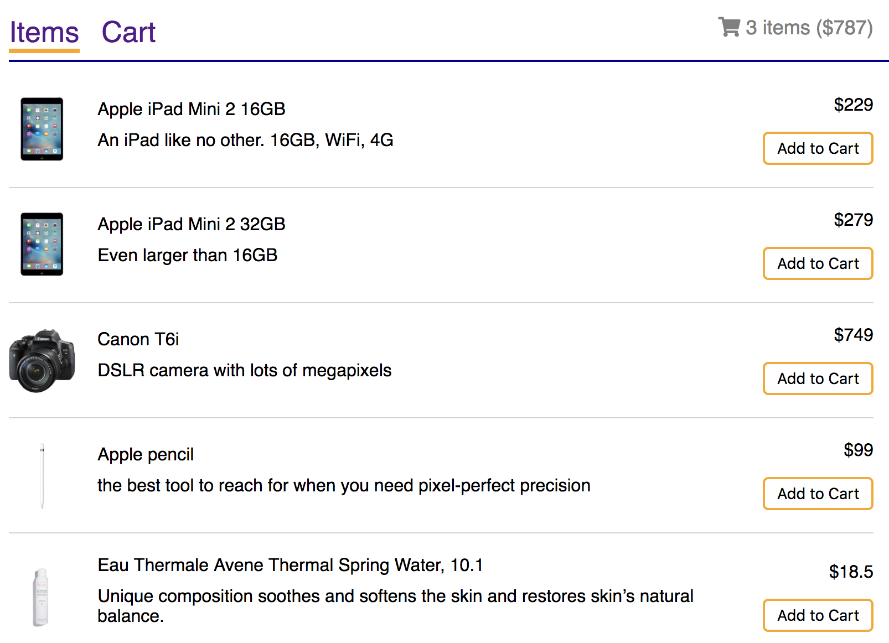
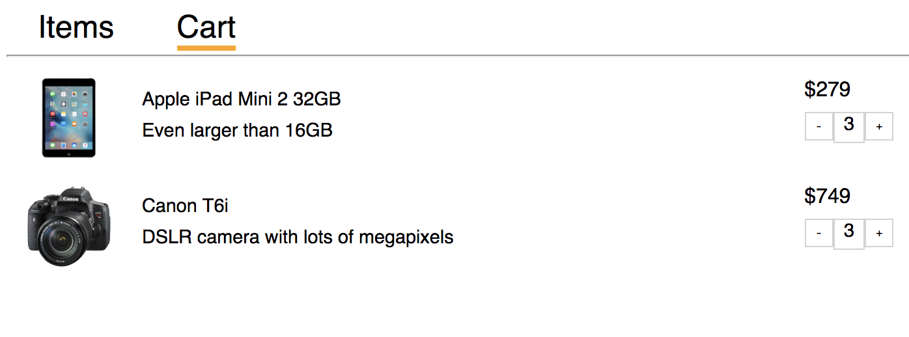

# Shopping cart Project

The project is built with ReactJS.
It is a shopping cart web app for users to browse items and shop. 

# App Functionalty

Users will be able to 

- see all items on the main (Item) page. 
- choose items and put them into the shopping cart.
- see quantities and total cost of the items in cart on both the main page and Cart Page.
- modify the quantities of items on Cart page.
- switch between two pages with the navigation bar. 

# Project Screenshot 

## ItemsPage

## CartPage

# Installation Instructions

- clone my repo git clone https://github.com/mavisluan/shopping_cart.git
- install all project dependencies with yarn install
- start the development server with yarn start

